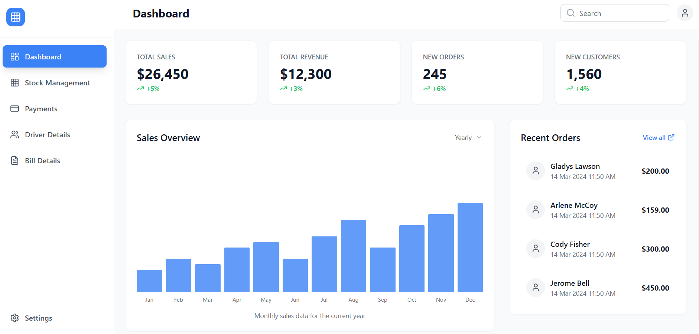
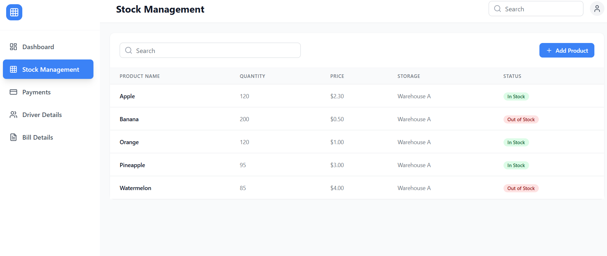
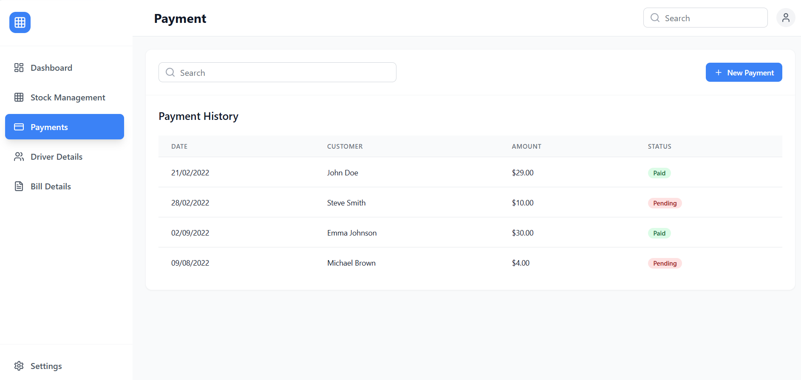
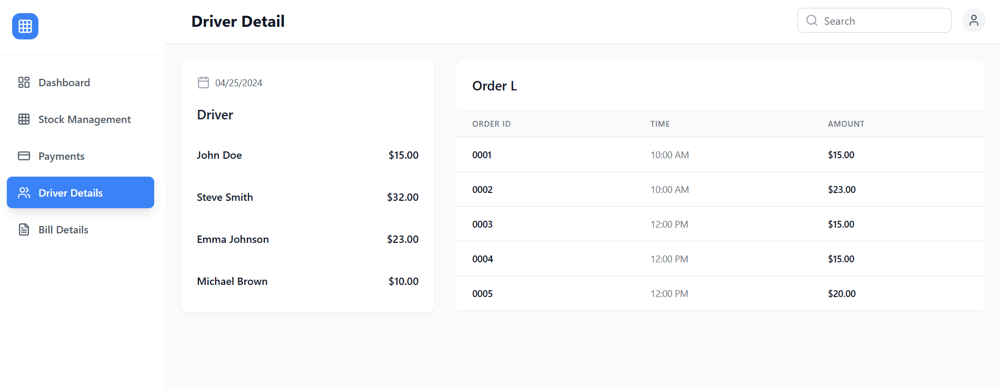
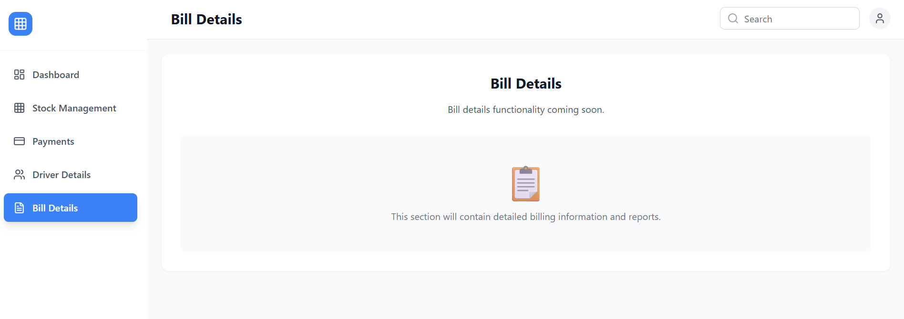

<p align="center">
  
</p>

<h1 align="center">📊 Business Dashboard App</h1>

<p align="center">
  A comprehensive business management dashboard for tracking sales, inventory, payments, drivers, and billing — all in one place.
</p>

<p align="center">
  
  
  
  
</p>

---

## 📑 Table of Contents

- [Screenshots](#-screenshots)
- [Features](#-features)
- [Tech Stack](#-tech-stack)
- [Folder Structure](#-folder-structure)
- [Getting Started](#-getting-started)
- [Available Scripts](#-available-scripts)
- [License](#-license)

---

## 📸 Screenshots

| Dashboard | Stock Management |
|:-:|:-:|
|  |  |

| Payment Page | Driver Details |
|:-:|:-:|
|  |  |

| Bill Details |
|:-:|
|  |

---

## ✨ Features

- 📈 **Dashboard Overview** — Sales charts, stats cards, and recent orders at a glance
- 📦 **Stock Management** — Track and manage inventory levels
- 💳 **Payment Tracking** — View and manage payments with modal details
- 🚚 **Driver Details** — Monitor driver information and delivery status
- 🧾 **Bill Management** — View and manage billing records
- 📱 **Responsive Design** — Collapsible sidebar with mobile-friendly layout

---

## 🛠️ Tech Stack

| Category | Technology |
|----------|-----------|
| **Frontend** | React 18, TypeScript |
| **Build Tool** | Vite 5 |
| **Styling** | Tailwind CSS 3 |
| **Icons** | Lucide React |
| **Linting** | ESLint 9 |

---

## 📁 Folder Structure

```
business_dashboard_app/
├── public/
│   ├── dashboard.png
│   ├── stock_manage.png
│   ├── payment.png
│   ├── driver_detail.png
│   └── bills_section.png
├── src/
│   ├── components/
│   │   ├── Header.tsx
│   │   ├── Sidebar.tsx
│   │   ├── SalesChart.tsx
│   │   ├── StatsCard.tsx
│   │   ├── RecentOrders.tsx
│   │   └── PaymentModal.tsx
│   ├── pages/
│   │   ├── Dashboard.tsx
│   │   ├── StockManagement.tsx
│   │   ├── PaymentPage.tsx
│   │   ├── DriverDetails.tsx
│   │   └── BillDetails.tsx
│   ├── App.tsx
│   ├── main.tsx
│   └── index.css
├── package.json
├── vite.config.ts
├── tailwind.config.ts
└── tsconfig.json
```

---

## 🚀 Getting Started

### Prerequisites

- **Node.js** 18 or higher
- **npm**, **yarn**, or **pnpm**

### Installation

```bash
# 1. Clone the repository
git clone <repository-url>
cd business_dashboard_app

# 2. Install dependencies
npm install

# 3. Start the development server
npm run dev
```

The app will be available at **http://localhost:5173**

> 💡 This is a frontend-only application with no environment variables required. All data is currently rendered from local state.

---

## 📜 Available Scripts

| Command | Description |
|---------|-------------|
| `npm run dev` | Start Vite development server |
| `npm run build` | Build for production |
| `npm run preview` | Preview production build locally |
| `npm run lint` | Run ESLint |

---

## 📄 License

MIT
